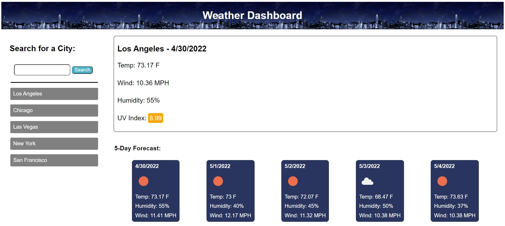

# Weather Dashboard

## Purpose
This website was an in-depth exposure to server-sided API's. I used openweatherweather.org's 'one-call' API to fetch 
information of weather in citites the user searches. I also used their geocoding API to transmute cities into read-able
latitude/longitude coordinates. I displayed this information on my website to create a fully functional weather dashboard.

## Build With
- HTML
- CSS
- JavaScript

## Website
https://magoofy.github.io/weather-dashboard/

## Contribution

Me, Myself, and I - Afi Akau
